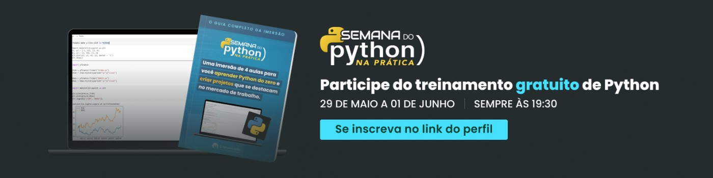
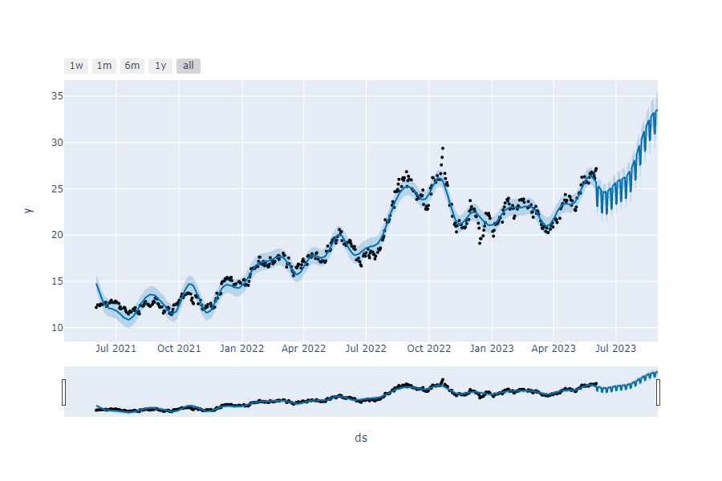

Nessa imersão, foram desenvolvidos 4 projetos práticos, ao longo da semana de 29/05 à 01/06. Utilizando os princípios básicos da linguagem Python e as melhores bibliotecas.
Passando por automação de processos, análise de dados e Machine Learning.

# Dia 1: Gerador de orçamentos em PDF

Para deixar a escolha de informações dinâmica, foi utilizado o método do input para pode ter entradas de dados em tempo real.
Depois de realizada a estrutura da entrada de dados, foi necessário importar a biblioteca [fpdf](https://pypi.org/project/fpdf/).
Nela é possível adicionar páginas, definir plano de fundo, fontes, cores, posição das variáveis no template.
Além de exportar o documento em PDF. Veja uma prévia do código e do resultado gerado:

```python
pdf.add_page()
pdf.set_font("Arial")
pdf.image("template.png", x=0, y=0)

pdf.text(115, 145, projeto)
pdf.text(115, 160, horas_estimadas)
pdf.text(115, 175, valor_hora)
pdf.text(115, 190, prazo)
pdf.text(115, 205, str(valor_total))

pdf.output("Orçamento.pdf")
print("Orçamento gerado com sucesso!")
```


# Dia 2: Automatização de envio de e-mail

Usando lógica de programação, foram definidos os passos para realização do processo.
Biliotecas utilizadas:

- `yfinance` baixa dados do mercado de ações do [yahoo finanças](https://pypi.org/project/yfinance/)
- `matplotlib` criar [visualizações](https://pypi.org/project/matplotlib/) estáticas, animadas e interativas
- `pyautogui` módulo de [automação](https://pypi.org/project/PyAutoGUI/) utilizado para controlar teclado e mouse
- `pyperclip` [utilitário](https://pypi.org/project/pyperclip3/) da área de transferência para copiar textos e dados binários

Após a definição da ação e dados que se quer obter dela, começa o processo de automação.
O pyautogui entra em ação de diversas formas, facilitando todo o trabalho de envio de e-mail recorrentes.

```python
# abre uma nova aba no navegador
pyautogui.hotkey("ctrl, t")

# copia o texto entre parênteses
pyperclip.copy("www.gmail.com")

# cola o texto copiado pelo pyperclip
pyautogui.hotkey("ctrl, v")

# confirma acesso no endereço colado
pyautogui.hotkey("enter")

# após a página abrir, clica no botão "escrever"
pyautogui.click(x=196, y=201)
```

Obs. Os comandos dados ao pyautogui (no código da aula) só funcionarão caso esta utilizando uma ferramenta de código pelo navegador (jupyter ou colab, por exemplo).

# Dia 3: Análise de dados com gráficos em python

Para a análise de dados com gráficos, foi importado um arquivo em excel.
Depois foram feitas análises exploratórias dos dados da planilha importada.
Detectando os tipos de dados e o que e que informação é relevante ser mostrada no gráfico, começou sua elaboração.

```python
# gera, exibe e exporta um gráfico para cada coluna salva anteriormente na lista
for coluna in lista_colunas:
    grafico = px.histogram(dados, x=coluna, y='preco', text_auto=True, color='forma_pagamento')
    grafico.show()
    grafico.write_html(f'faturamento_{coluna}.html')
```

A biblioteca utilizada para plotar os gráficos foi a [plotly_express]([https://pypi.org/project/plotly-express/](https://plotly.com/python/plotly-express/)).
Ela é uma ferramenta low-code para criação de gráficos dinâmicos e extremamente interativos.

[Gráfico animado](dia03/grafico_animado.html)

# Dia 4: Análise financeira com aprendizado de máquina

Aproveitando a biblioteca yfinance, foi criado um modelo de machine learning simples, mas muito poderoso.
Foram coletados dados de 2 anos de uma das maiores ações do país e aplicado um treinamento para o modelo.

```python
# reseta o índice para utilizar a coluna de data
treinamento = dados.reset_index()

# armazena as colunas necessárias na variável de treinamento
treinamento = treinamento[['Date', 'Close']]

# remove o fuso horário da coluna de data
treinamento['Date'] = treinamento['Date'].dt.tz_localize(None)

# renomeia as colunas para o padrão de ML
treinamento.columns = ['ds', 'y']
```

Após preparar os dados para o treinamento, começa então a criação do modelo e suas previsões.
Foi utilizada a biblioteca [Prophet](https://pypi.org/project/prophet/), procedimento para prever dados de séries temporais.

```python
modelo = Prophet()
modelo.fit(treinamento)

periodo = modelo.make_future_dataframe(90)
periodo.tail()

previsoes = modelo.predict(periodo)
previsoes

plot_plotly(modelo, previsoes)
```

Só então é exibido o resultado das análises preditivas realizadas:


